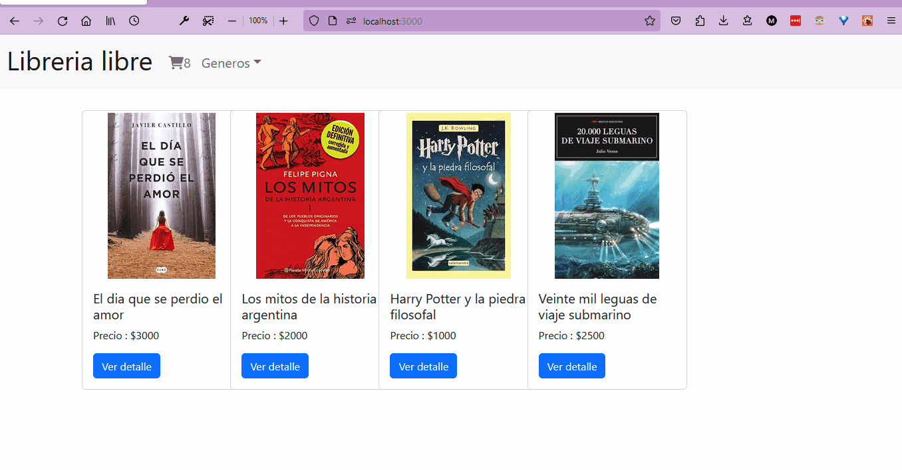

# E commerce con React

## Premisa:
 E commerce de libros

---

## Dependencias usadas por fuera de lo que es el curso :
- Bootstrap : para un rapido desarrollo de las vistas

---

## Gift de navegabilidad:

---
## Que debo hacer para probar la app

- ### `clone`
    Se debe clonar el repositorio

- ### `npm install`
  Se deben instalar las dependencias correspondientes para el funcionamiento de la app

- ### `npm start`
    Ejecutar el servidor de desarrollo

